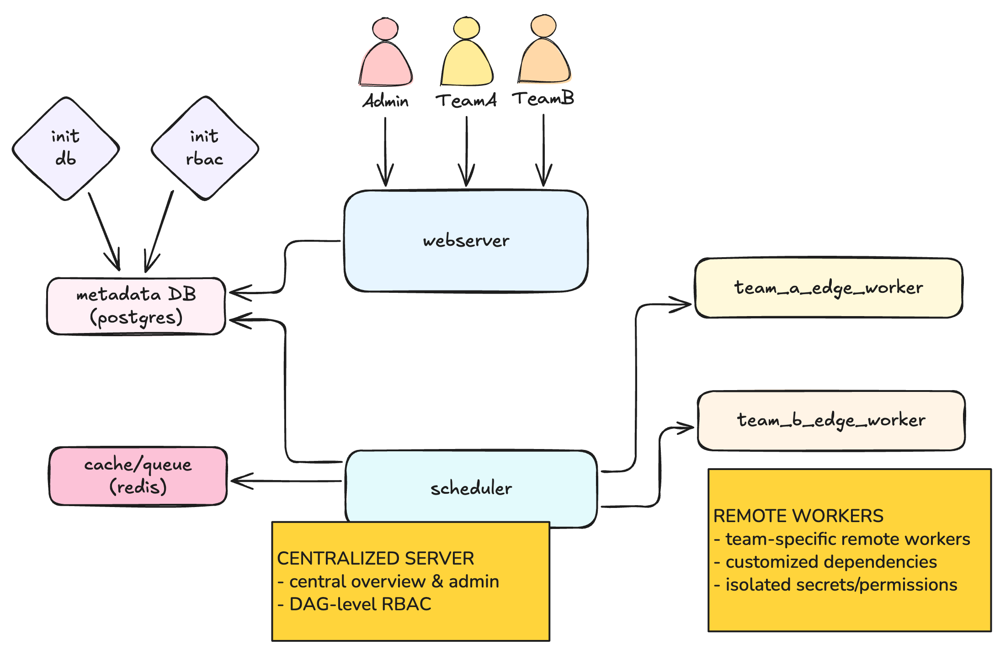

# Airflow 2.10 EdgeExecutor Testbed (Docker Compose)

This repository provides a fully containerized local testbed for Airflow 2.10.5 using Docker Compose (including the Airflow Triggerer for deferrable operators) and a reusable image + guide for Cloud Run deployments.

## Purpose

This project is designed to:
- Run a local, container-only Airflow 2.10.5 stack for experimentation and demos.
- Demonstrate the EdgeExecutors pattern with per-team isolated workers and queues.
- Showcase an RBAC setup that scopes UI and DAG edit rights per team (Team A and Team B).



## Local testbed

### Getting started

1) Create your `.env` from the template and generate secrets:

```bash
cp .env.example .env
# Generate values (examples):
python3 - <<'PY'
from cryptography.fernet import Fernet
import secrets, os
print('FERNET_KEY=', Fernet.generate_key().decode())
print('INTERNAL_API_SECRET_KEY=', secrets.token_hex(32))
print('WEBSERVER_SECRET_KEY=', secrets.token_hex(32))
print('EDGE_WORKER_API_SECRET_KEY=', secrets.token_urlsafe(48))
PY
```

Paste the printed values into `.env`.

2) Build and start the stack:

```bash
docker compose up -d --build
```

3) Check health and RBAC bootstrap logs:

```bash
docker compose ps
docker compose logs -f airflow-webserver | sed -n '1,200p'
docker compose logs -f airflow-rbac-init | sed -n '1,200p'
```

4) Open the UI at `http://localhost:8080` and log in as `admin`/`admin` or the demo users `team_a_user`/`test`, `team_b_user`/`test`.

### Requirements
- macOS, Docker Desktop
- A `.env` file in the project root providing required secrets (see below)

### Start services (all-in-one)

```bash
docker compose up -d --build
```

This launches Postgres, Redis, Airflow init, Airflow webserver, scheduler, triggerer, the RBAC bootstrap sidecar, and both team edge workers.

Health endpoints:
- Team A: http://localhost:8081/healthz
- Team B: http://localhost:8082/healthz

Queues and isolation:
- Team A worker serves `team_a_queue`
- Team B worker serves `team_b_queue`
- Update pools/queues as needed via Airflow UI or env vars

## Cloud Run + Composer 3 (EdgeExecutors)

Use the reusable image and guide under `edge-executors/`:
- Build and push to Artifact Registry
- Create Secret Manager secret for the Edge API key (matches Composer `[edge] edge_worker_api_secret_key`)
- Create per-team Cloud Run services with separate service accounts
- Use a Serverless VPC Connector for Private IP Composer

Quick links:
- `edge-executors/Dockerfile`
- `edge-executors/entrypoint.sh`
- `edge-executors/README.md` (full commands)

### UI segregation (RBAC)

RBAC is consolidated to two team roles:
- `team_a_user`: Viewer UI permissions; full control (read+edit) of `team_a_*` DAGs; read-only on others
- `team_b_user`: Viewer UI permissions; full control (read+edit) of `team_b_*` DAGs; read-only on others

Bootstrap is automated via the `airflow-rbac-init` sidecar in `docker-compose.yaml` after the webserver is healthy. It also creates demo users:
- `team_a_user` / `test`
- `team_b_user` / `test`

If you need to run it manually:

```bash
docker compose exec airflow-webserver python /opt/airflow/scripts/setup_rbac.py
```

## Project structure

```
airflow-testbed/
├── airflow.Dockerfile             # Base Airflow image for local compose
├── docker-compose.yaml            # Local Docker-based environment (Airflow + workers + triggerer)
├── webserver_config.py            # Airflow webserver (Flask AppBuilder) config
├── README.md
├── dags/                          # Team A, Team B, admin DAGs
│   ├── admin/
│   │   └── admin_monitoring_dag.py
│   ├── team_a/
│   │   └── team_a_python_dag.py
│   └── team_b/
│       └── team_b_python_dag.py
├── scripts/
│   └── setup_rbac.py              # Bootstrap team roles and demo users
|   └── airflow_init.sh            # Initialize Airflow instance setup 
├── plugins/                       # (optional) Airflow plugins
└── edge-executors/                # Cloud Run container and deployment guide
    ├── Dockerfile                 # Reusable Edge worker image (parameterized)
    ├── team-a.Dockerfile          # Team A variant (queue/env)
    ├── team-b.Dockerfile          # Team B variant (queue/env)
    ├── entrypoint.sh              # Edge worker launch script
    ├── healthz.py                 # Simple health endpoint
    ├── requirements.txt           # Base dependencies
    ├── requirements.team-a.txt    # Team A extras
    ├── requirements.team-b.txt    # Team B extras
    └── README.md                  # Cloud Run deployment guide
```

## Notes
- For Cloud Run, keep `--min-instances >= 1` and `--no-cpu-throttling` to allow continuous polling.
- For Private IP Composer, use a VPC connector and private ranges egress.
- Use queues/pools and Airflow RBAC to enforce team isolation.

### Deferrable operators & triggerer

Deferrable sensors/operators (e.g., the `ExternalTaskSensor` in deferrable mode) require the `airflow-triggerer` service. If you disable or remove it, either turn off deferrable mode on those operators or expect warnings and fallback behavior.

### Environment variables (reference)

These are read from your `.env` file by `docker-compose.yaml`:

- `POSTGRES_USER`, `POSTGRES_PASSWORD`, `POSTGRES_DB` – local Postgres credentials used by Airflow.
- `FERNET_KEY` – Airflow Fernet key for encrypting connections/variables.
- `INTERNAL_API_SECRET_KEY` – Airflow internal API secret used by components.
- `WEBSERVER_SECRET_KEY` – Flask AppBuilder secret key for sessions.
- `EDGE_WORKER_API_SECRET_KEY` – Secret used by Edge workers to authenticate to the Airflow Edge API (must match workers).
- Optional RBAC demo vars:
    - `RBAC_DEMO_DEFAULT_PASSWORD` – default password for `team_a_user` and `team_b_user` (default `test`).
    - `TEAM_A_USER_PASSWORD`, `TEAM_B_USER_PASSWORD` – override per-user.
    - `RBAC_DEMO_FORCE_RESET` – reset demo user passwords on each run (`true`/`false`).

## Troubleshooting
- 401/403 from Edge API: secret mismatch or wrong Edge URL.
- No tasks picked: DAG `queue` doesn’t match worker queues or pool slots exhausted.
- Cloud Run cannot reach Composer: VPC connector or firewall issues.

## Clean reset & run (local compose)

Use the provided `.env` for secrets. To rebuild from scratch and start everything, run:

```bash
docker compose down -v --remove-orphans
docker compose build --no-cache
docker compose up -d
```

Then check health and RBAC bootstrap (add triggerer logs if using deferrables):

```bash
docker compose ps
docker compose logs -f airflow-webserver | sed -n '1,200p'
docker compose logs -f airflow-triggerer | sed -n '1,120p'
docker compose logs -f airflow-rbac-init | sed -n '1,200p'
```

Access the UI at http://localhost:8080 and log in as `admin` / `admin` or the demo team users above.

## Removed legacy local-run files
This repository has been simplified to container-only. The following local-only artifacts are no longer tracked or needed:
- `airflow.cfg` (local path-based config) – replaced by env vars in `docker-compose.yaml`
- `requirements.txt` (venv) – Python deps are installed in the Dockerfiles
- `start_airflow.sh`, `stop_airflow.sh` – lifecycle is managed via Docker Compose
- `__pycache__/`, `*.pyc`, local `.venv/` – runtime artifacts

If you still have them locally, you can delete them safely. They’re also covered by `.gitignore`.

## License
This repository is for educational/testing purposes. See Apache Airflow license for production usage.
